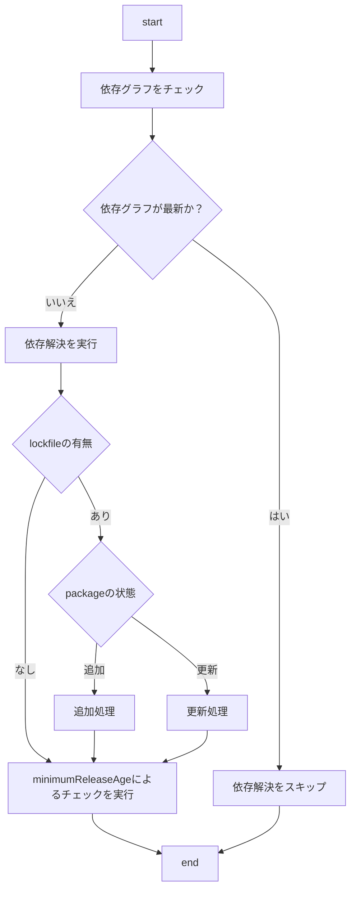

:::message
本記事は  [Timee Product Advent Calendar 2025](https://qiita.com/advent-calendar/2025/timee-product) 10 日目の記事です。
:::

昨今、サプライチェーン攻撃が多いことを受け、社内でも各種対応を進めています。この記事ではそのうちの一つでもある、pnpm の `minimumReleaseAge` を取り上げ、どういう挙動なのかを確かめていきます。

## TL;DR

- `minimumReleaseAge` を設定していれば、対象の package が install されることはない、と理解するのは半分正解で半分間違っている
  - `minimumReleaseAge` が有効に効くのは依存グラフの解決をするとき
  - 依存グラフが解決済みの場合は `minimumReleaseAge` は考慮されない

## 前提

`minimumReleaseAge`[^minimumReleaseAge] は pnpm v10.16.0 から入った機能で、package の公開から特定時間経過したもののみを install できるようにする設定です。

[^minimumReleaseAge]: <https://pnpm.io/ja/settings#minimumreleaseage>

> `minimumReleaseAge` defines the minimum number of minutes that must pass after a version is published before pnpm will install it. This applies to all dependencies, including transitive ones.

ただそれだと困るケースもあるので、エスケープハッチとして `minimumReleaseAgeExclude` [^minimumReleaseAgeExclude] を使った除外設定をすることもできます。これも同じく v10.16.0 から入っており、後続のバージョンで glob pattern での指定や version での指定など、機能改善が加えられています。

[^minimumReleaseAgeExclude]: <https://pnpm.io/ja/settings#minimumreleaseageexclude>

> If you set `minimumReleaseAge` but need certain dependencies to always install the newest version immediately, you can list them under minimumReleaseAgeExclude. The exclusion works by package name and applies to all versions of that package.

## 検証環境

本記事では以下の環境をベースとして検証を進めていきます。

```bash
$ pnpm -v
10.24.0 # minimumReleaseAge が使える v10.16.0 以上なら、いずれのバージョンでも可
```

```json:package.json
{
  "name": "minimum-release-age",
  "version": "0.0.1",
  "description": "",
  "main": "index.js",
  "scripts": {
    "test": "echo \"Error: no test specified\" && exit 1"
  },
  "keywords": [],
  "author": "",
  "license": "ISC",
  "packageManager": "pnpm@10.24.0"
}
```

```yaml:pnpm-workspace.yaml
minimumReleaseAge: 4320 # 3 days
```

## 依存関係を追加する

なんでも良いので、 `minimumReleaseAge` で設定したものに該当する package を追加してみます。執筆時点で `storybook` が該当範囲内に公開されていたので、本記事ではこれを使います。

```bash
$ pnpm i storybook@10.1.0
 ERR_PNPM_NO_MATCHING_VERSION  No matching version found for storybook@10.1.0 published by Tue Nov 25 2025 14:51:50 GMT+0900 (Japan Standard Time) while fetching it from https://registry.npmjs.org/. Version 10.1.0 satisfies the specs but was released at Thu Nov 27 2025 00:23:39 GMT+0900 (Japan Standard Time)

This error happened while installing a direct dependency of /[project_root]

The latest release of storybook is "10.1.0". Published at 11/27/2025

Other releases are:
  * debug: 6.0.28-alpha.3 published at 10/29/2020
  * prerelease: 6.5.17-alpha.0 published at 3/23/2023
  * future: 7.1.0-alpha.29 published at 6/6/2023
  * pr-22631: 7.1.1-pr-22631-1689802540-351503cb.0 published at 7/20/2023
  * pr-23508: 7.1.1-pr-23508-1689802571-5ec8c1c3.0 published at 7/20/2023
  * tag-for-publishing-older-releases: 8.2.10 published at 11/4/2024
  * next: 10.2.0-alpha.0 published at 11/27/2025
  * canary: 0.0.0-pr-33206-sha-2fd88b76 published at 11/27/2025 7:20:30 PM

If you need the full list of all 2378 published versions run "$ pnpm view storybook versions".

If you want to install the matched version ignoring the time it was published, you can add the package name to the minimumReleaseAgeExclude setting. Read more about it: https://pnpm.io/settings#minimumreleaseageexclude
Progress: resolved 1, reused 1, downloaded 0, added 0
```

期待通りエラーになることが確認できました。

## 依存関係を更新する

続いて、バージョンアップの場合も見ていきます。Next.js が canary リリースを行っていて検証しやすいので、本記事では Next.js を対象にします。

まず Next.js v15.x が dependencies に存在する状態を作ります。

```json:package.json
{
  "name": "minimum-release-age",
  "version": "0.0.1",
  "description": "",
  "main": "index.js",
  "scripts": {
    "test": "echo \"Error: no test specified\" && exit 1"
  },
  "keywords": [],
  "author": "",
  "license": "ISC",
  "packageManager": "pnpm@10.24.0",
  "dependencies": {
    "next": "15.5.6"
  }
}

```

この状態で執筆時点で最新の canary リリースに更新してみます。

```bash
$ pnpm i next@v16.1.0-canary.4
 ERR_PNPM_NO_MATCHING_VERSION  No matching version found for next@v16.1.0-canary.4 published by Tue Nov 25 2025 14:55:39 GMT+0900 (Japan Standard Time) while fetching it from https://registry.npmjs.org/. Version 16.1.0-canary.4 satisfies the specs but was released at Thu Nov 27 2025 08:31:17 GMT+0900 (Japan Standard Time)

This error happened while installing a direct dependency of /[project_root]

The latest release of next is "16.0.5". Published at 11/27/2025

Other releases are:
  * next-11: 11.1.4 published at 1/27/2022
  * next-12-2-6: 12.2.6 published at 9/30/2022
  * next-14-1: 14.1.1 published at 3/1/2024
  * rc: 15.0.0-rc.1 published at 10/16/2024
  * next-13: 13.5.11 published at 3/27/2025
  * next-12-3-2: 12.3.7 published at 3/29/2025
  * next-14: 14.2.33 published at 9/24/2025
  * beta: 16.0.0-beta.0 published at 10/10/2025
  * canary: 16.1.0-canary.4 published at 11/27/2025

If you need the full list of all 3477 published versions run "$ pnpm view next versions".

If you want to install the matched version ignoring the time it was published, you can add the package name to the minimumReleaseAgeExclude setting. Read more about it: https://pnpm.io/settings#minimumreleaseageexclude
```

こちらも同様に、期待通りエラーになることが確認できました。

## 除外設定をして依存関係を更新する

では続いて、先程の canary リリースに更新するため、 `minimumReleaseAgeExclude` を設定します。

```yaml:pnpm-workspace.yaml
minimumReleaseAge: 4320 # 3 days
minimumReleaseAgeExclude:
  - next
  - "@next/env"
```

この状態で更新することができるか確認してみます。

```bash
$ pnpm i next@v16.1.0-canary.4
Packages: +2 -3
++---
Progress: resolved 43, reused 21, downloaded 0, added 0, done

dependencies:
- next 15.5.6
+ next 16.1.0-canary.4

Done in 1.7s using pnpm v10.24.0
```

`minimumReleaseAgeExclude` が効いており、問題なく更新できることが確認できました。

## 除外設定を戻して pnpm install する

さて前置きが長くなりましたが、ここが本題です。canary に更新された状態で、 `minimumReleaseAgeExclude` を削除して元の状態に戻します。

```json:package.json
{
  "name": "minimum-release-age",
  "version": "0.0.1",
  "description": "",
  "main": "index.js",
  "scripts": {
    "test": "echo \"Error: no test specified\" && exit 1"
  },
  "keywords": [],
  "author": "",
  "license": "ISC",
  "packageManager": "pnpm@10.24.0",
  "dependencies": {
    "next": "16.1.0-canary.4"
  }
}
```

```yaml:pnpm-workspace.yaml
minimumReleaseAge: 4320 # 3 days
```

この状態で pnpm install をするとどうなるでしょうか。

```bash
$ pnpm i
Lockfile is up to date, resolution step is skipped
Packages: +20
++++++++++++++++++++
Progress: resolved 20, reused 20, downloaded 0, added 20, done

dependencies:
+ next 16.1.0-canary.4

╭ Warning ───────────────────────────────────────────────────────────────────────────────────╮
│                                                                                            │
│   Ignored build scripts: sharp.                                                            │
│   Run "pnpm approve-builds" to pick which dependencies should be allowed to run scripts.   │
│                                                                                            │
╰────────────────────────────────────────────────────────────────────────────────────────────╯

Done in 1.7s using pnpm v10.24.0
```

`minimumReleaseAge` が効いてエラーになるかと思いましたが、エラーにはなりませんでした。確かにこの状態のときにエラーになってしまうと環境の再現性が確保できない（コードは同じなのに今日はエラーになるが明日は通る、など）ので、よく考えればあるべき挙動です。

## 依存グラフを解決するとき、しないとき

ここまでの確認結果から、`minimumReleaseAge` の設定が効いてくるタイミングが見えてきました。実行したときに依存グラフが解決していればスキップされ、そうでないならば有効になりそうです。

この挙動を確かめるために DeepWiki[^deepwiki] を使いつつ、実装[^pnpm]を追いかけてみます。かなり簡素化したフローですが、これまでの結果から推察できたように、以下のような処理であることがわかりました。

[^deepwiki]: <https://deepwiki.com/pnpm/pnpm>
[^pnpm]: <https://github.com/pnpm/pnpm>



## おわりに

追加・更新など複数のパターンを通して、 `minimumReleaseAge` の挙動を追いかけてきました。社内で開発するアプリケーションに関しては問題になることはないと思いますが、悪意の有無に関わらず `minimumReleaseAge` をバイパスすることができてしまいます。そこまでシビアになる必要はないとは思いますが、 `minimumReleaseAge` が設定されているから大丈夫、と盲信してしまうと思わぬ事故につながる可能性があるので、注意が必要です。

Happy Coding！ :)

### 宣伝

僕と一緒にコードを書きましょう！ 💪

- [プロダクト採用サイト TOP](https://product-recruit.timee.co.jp/)
- [カジュアル面談申込はこちら](https://product-recruit.timee.co.jp/casual)
